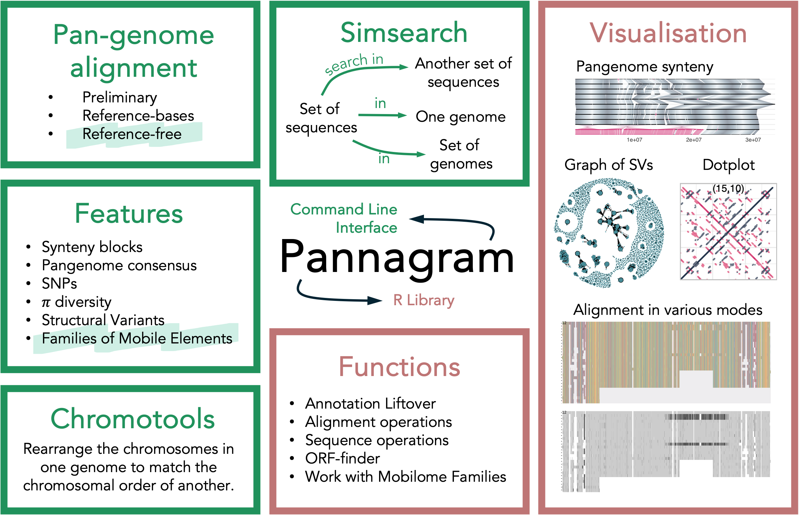

# Pannagram

<!-- 


 -->



## Overview

Pannagram is a toolkit for building reference-free linear pangenome alignments and analyzing genomic polymorphisms.  
It consists of a command-line interface (CLI) for alignment construction, feature extraction, and sequence search, and an R library for downstream analysis and visualization.

Key capabilities:
- Reference-free pangenome alignment
- SNP and structural variant detection
- Mobile element family discovery
- Search for sequences in genomes
- Annotation liftover between genomes
- Visualization and sequence analysis

Documentation can be found at [Pannagram-page](https://iganna.github.io/pannagram/).

## Quick Installation

Clone the repository and create the conda environment:

```
git clone https://github.com/<user>/pannagram.git
cd pannagram
conda env create -f pannagram.yml
conda activate pannagram
./user.sh
./verify_installation.sh  # Verify the successful installation
```

## Quick Start

The typical workflow consists of two steps:
1. Build the pangenome alignment
2. Call genomic features from the alignment

Before running the example, set the following variables (preferably absolute paths) in the command line:

- `PATH_GENOMES` – directory containing input genome FASTA files
- `PATH_PROJECT` – directory where the project output will be stored

### Reference-Free Pangenome Alignment

Run the following command to perform a reference-free pangenome alignment:

```bash
pannagram  -path_genomes ${PATH_GENOMES} \
           -path_project ${PATH_PROJECT} \
           -cores 8
```

### Feature Calling

After the alignment step is complete, run the feature-calling module to identify all available genomic features:

```bash
features  -path_project ${PATH_PROJECT} \
          -synteny \
          -consensus \
          -snp \
          -snp_pi \
          -sv \
          -sv_families \
          -cores 8
```

All results will be saved under ${PATH_PROJECT} after both steps are complete:

```
PATH_PROJECT/  
├── features/     ← main analysis outputs  
└── plots/        ← visualizations and figures  
```

A detailed description of all output files and their formats is available in the documentation under **Getting Started → Output Data**.


## Pannagram R Library

In your R session, load the library:
```R
library(pannagram)
```

Pannagram R library provides functions for:
- working with FASTA files
- annotation liftover
- extracting specific pangenome regions as multiple sequence alignments
- ORF finding and visualization
- dot plots
- multiple sequence alignment visualization
- pangenome plots

For detailed documentation, visit the [Pannagram-page](https://iganna.github.io/pannagram/).

## Citation

If you use Pannagram, please cite:

- **Pannagram: unbiased pangenome alignment and Mobilome calling**  
  *Anna A. Igolkina et al.*, *bioRxiv*, 2025. [**Link**](https://doi.org/10.1101/2025.02.07.637071)

To explore Pannagram applications, we recommend:

- **A comparison of 27 *Arabidopsis thaliana* genomes and the path toward an unbiased characterization of genetic polymorphism**  
  *Anna A. Igolkina et al.*, *Nature Genetics*, 2025. [**Link**](https://doi.org/10.1038/s41588-025-02293-0)


## Acknowledgements

**Development:**
- Anna Igolkina - Lead Developer and Project Initiator
- Alexander Bezlepsky - Assistant

**Testing:**
- Anna Igolkina: Lead Tester
- Anna Glushkevich: Testing the alignment on _A. lyrata_ genomes
- Elizaveta Grigoreva: Testing the alignment on _A. thaliana_ and _A. lyrata_ genomes
- Jilong Ma: Testing the SV-graph on spider genomes
- Alexander Bezlepsky: Testing the Pannagram's functionality on Rhizobial genomes
- Gregoire Bohl-Viallefond: Testing the annotation converter on _A. thaliana_ alignment

**Resources:**
- Parallel Processing Tool: O. Tange (2018): GNU Parallel 2018, ISBN 9781387509881, DOI [https://doi.org/10.5281/zenodo.1146014](https://doi.org/10.5281/zenodo.1146014).
