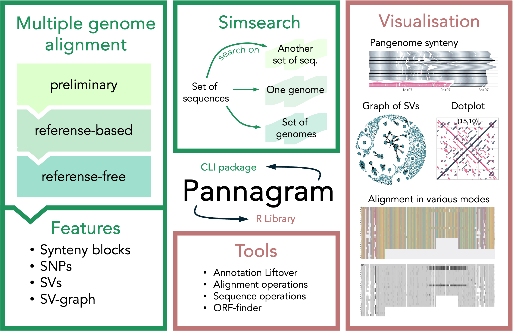

# Pannagram



<div style="width: 90%;">

**Pannagram** is a package for constructing pan-genome alignments, analyzing structural variants, and translating annotations between genomes. A project consists of several **Bash** pipelines for streamline genomic analisys and an **R** library with tools for further analysis and visualization.
</div>

Documentation can be found at [pannagram-page](https://iganna.github.io/pannagram/).

## Setting Up the Working Environment

After cloning the repo follow these instructions to set up your **pannagram** environment.

### Prerequisites

It is expected, that you have one of the following package managers installed on your machine:
- [Conda](https://docs.conda.io/projects/conda/en/latest/index.html)
- [Mamba](https://github.com/mamba-org/mamba)
- [Micromamba](https://github.com/mamba-org/mamba#micromamba)

Below package manager of your choice is refered to as `<manager>`.

### Linux

```bash
<manager> env create -f pannagram.yml
<manager> activate pannagram
```

### macOS (M-series chips)

```bash
<manager> env create --platform osx-64 -f pannagram_m4.yml
<manager> activate pannagram
```

### Alternative: Setting Up the Environment Without Explicit Versions

If you want to resolve package dependencies by yourself use `pannagram_min.yml` where only direct dependencies are specified with no explicit versions. Packages will be thus installed with the latest compatible versions available:

**Linux and macOS (Intel)**

```bash
<manager> env create -f pannagram_min.yml
<manager> activate pannagram
```

**macOS (M-series chips)**

```bash
<manager> env create --platform osx-64 -f pannagram_min.yml
<manager> activate pannagram
```

### Running RStudio with the Environment

Make sure that [RStudio-Desktop](https://posit.co/download/rstudio-desktop/) is installed.
Then run the following in the command line:

```bash
<manager> activate pannagram
open -a RStudio
```

One may also create an alias:
```bash
alias panR="<manager> activate pannagram && open -a RStudio"
```

### Installing Pannagram in Already Running RStudio Environment

We encourage you to run RStudio from activated package environment, but if RStudio server is already running and you want to install **pannagram** there as an R package run in console:
```R
setwd("<path to pannagram repo>")
source("install_in_rstudio.R")
```

### Included Dependencies

**Pannagram** package environment includes the following dependencies and they are accessible directly via the command line:

- R interpreter (required version)
- [BLAST](https://www.ncbi.nlm.nih.gov/books/NBK279690/)
- [MAFFT](https://mafft.cbrc.jp/alignment/software/manual/manual.html)
- [VCFtools](https://vcftools.github.io/)
- [PLINK](https://www.cog-genomics.org/plink2/)


### For Windows Users
Windows users may use [WSL](https://learn.microsoft.com/en-us/windows/wsl/install) following steps described for Linux users but be warned, that we have never tested **pannagram** in such environment.

## Pannagram as a suite of bash pipelines
<!-- <h2 style="display: flex; align-items: center; gap: 0.5ex;">
    
  <span>Pannagram as a suite of bash pipelines</span>
</h2> -->

An extended description of the parameters for all scripts are avaliable by executing scripts with the flag `-help`.

### 1. Pangenome linear alignment with `pannagram`

* **Preliminary mode** helps you give a quick look at your genomes when you start your research:
    ```shell
    pannagram -pre \
        -path_in '<directory with your genomes as FASTA files>' \
        -path_out '<directory to put the results in (will be created)>' \
        -ref '<reference genome filename with no FASTA suffix>' \
        -cores 8
    ```
    Here `-ref` argument is some name from `-path_in` directory with FASTA suffix ommited. If path to your reference genome is different provide it using `-path_ref`. Each subsequent run with different `-ref` will create separate subdirectory inside `-path_in`.

* **Reference-based mode** runs full alignmnet pipeline for aligning all genomes to the given genome :
    ```shell
    pannagram \
        -path_in '<directory with your genomes as FASTA files>' \
        -path_out '<directory to put the results in (will be created)>' \
        -ref '<reference genome filename with no FASTA suffix>' \
        -cores 8
    ```
    Here the **pannagram** expects your genomes to have the same number of chromosomes. If it is not the case, specify `-nchr` integer parameter to truncate analisys to specific number of chromosomes. Read about `-ref` and `-path_ref` parameters above.

* **Reference-free (MSA) mode** runs full alignmnet pipeline for aligning all genomes to the given genome:
    ```shell
    pannagram \
        -path_in '<directory with your genomes as FASTA files>' \
        -path_out '<directory to put the results in (will be created)>' \
        -cores 8
    ```
    Once again specify `-nchr` integer parameter if needed.

>To facilitate correct execution of other **pannagram** scripts and functions do not alter output subdirectories content!

### 2. Feature extraction with `features`

After running `pannagram` pipeline you are able to get more features of your data! Pay attention, some of flags are independent from each other, others need to be passed together:
* **Extract information** from the pangenome alignment:
    ```sh
    features -path_in '<same as -path_out of pannagram>' \
        -blocks  \  # Find Synteny block inforamtion for visualisation
        -seq  \     # Create consensus sequence of the pangenome
        -snp \      # SNP calling
        -cores 8
    ```

* **Structural variants** calling. When the pangenome linear alignment is built, SVs can be called using the following command:
    ```sh
    features -path_in '<same as -path_out of pannagram>' \
        -sv_call  \         # Create output .gff and .fasta files with SVs
        -sv_sim te.fasta \  # Compare with a set of sequences (e.g., TEs)
        -sv_graph  \        # Construct the graph of SVs
        -cores 8
    ```

### 3. Search for similar sequences with `simsearch`

* **...in set of sequences** This approach is designed to search for similarities against another set of sequences. 
    ```sh
    simsearch \
        -in_seq genes.fasta \
        -on_seq genome.fasta \
        -sim 90 \
        -out "<out path>"
    ```

* **...in the genome** This approach involves searching against entire genomes or individual chromosomes:
    ```sh
    simsearch \
        -in_seq genes.fasta
        -on_genome genome.fasta \
        -out "<out path>"
    ```
    The result is a GFF file with hits matching the similarity threshold.

* **...on all genomes in directory** Here we learch in all genomes in given directory:
    ```sh
    simsearch \
        -in_seq genes.fasta \
        -on_path "<path to genomes>" \
        -out "<out path>"
    ```

## Pannagram as an R package
<!-- <h2 style="display: flex; align-items: center; gap: 0.5ex;">
    
  </a>
  <span>Pannagram as an R package</span>
</h2> -->

0. In your R session call the library:
    ```R
    library(pannagram)
    ```
1. Extract the part of the alignment within given window (will work after if `features` was called with `-seq` flag):
    ```R
    path.project = "<same path as for -path_out of pannagram>"
    aln.seq <- cutAln(path.proj=path.project,
                      i.chr=1,
                      p.beg=1,
                      p.end=20000,
                      acc="<single accession from your genomes>")
    ```
2. Build and save alignment window plots:
    ```R
    p.nucl <- msaplot(aln.seq)
    p.diff <- msadiff(aln.seq)
    ```
3. And save them as pdf:
    ```R
    savePDF(p.nucl,
            path="<specify desired output path>",
            name="msa_nucl",
            width=7,
            height=5)
    savePDF(p.diff,
            path="<specify desired output path>",
            name="msa_diff",
            width=7,
            height=5)
    ```
4. You'll get pictures similar to:

    <table align='center'>
    <t0>
        <td></td>
        <td></td>
    </tr>
    </table>

    >For more examples and detailed documentation visit [Docuentation Pages](https://iganna.github.io/pannagram/).


## Acknowledgements

**Development:**
- Anna Igolkina - Lead Developer and Project Initiator
- Alexander Bezlepsky - Assistant

**Testing:**
- Anna Igolkina: Lead Tester
- Anna Glushkevich: Testing the alignment on _A. lyrata_ genomes
- Elizaveta Grigoreva: Testing the alignment on _A. thaliana_ and _A. lyrata_ genomes
- Jilong Ma: Testing the SV-graph on spider genomes
- Alexander Bezlepsky: Testing the Pannagram's functionality on Rhizobial genomes
- Gregoire Bohl-Viallefond: Testing the annotation converter on _A. thaliana_ alignment

**Resources:**
- Logo was generated with the help of DALL-E
- Parallel Processing Tool: O. Tange (2018): GNU Parallel 2018, ISBN 9781387509881, DOI [https://doi.org/10.5281/zenodo.1146014](https://doi.org/10.5281/zenodo.1146014).
