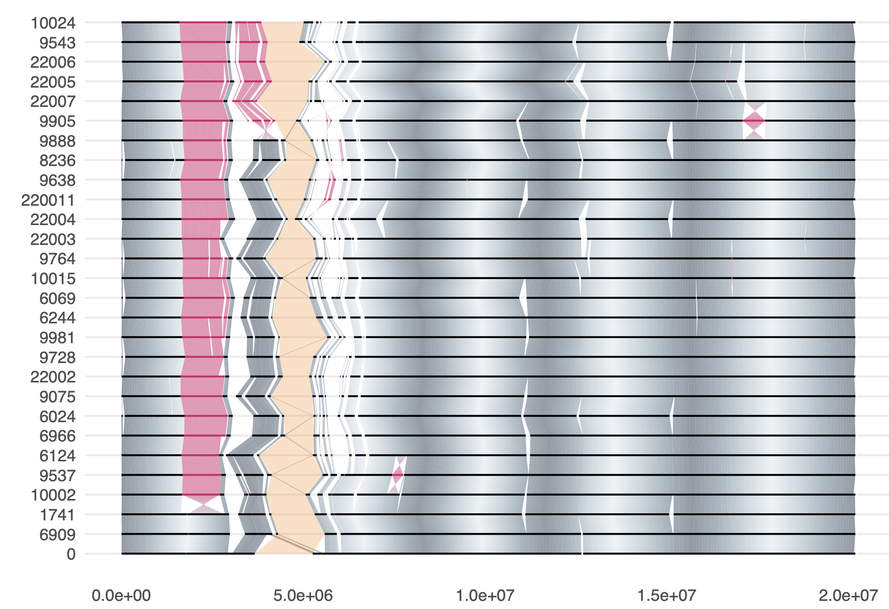

<p align="left">

</p>

# Pannagram


Pannagram is a package for constructing pan-genome alignments, analyzing structural variants, and translating annotations between genomes.
Additionally, Pannagram contains useful functions for visualization. The manual is available in the [examples](./examples) folder.


### Recreating working environment

Make sure you have [Conda](https://docs.conda.io/projects/conda/en/latest/index.html) or [Mamba](https://github.com/mamba-org/mamba) installed. To create and activate the package environment run:
```sh
conda env create -f environment.yml
conda activate pannagram
```
The environment downloads required R interpreter version and all needed libraries, including [BLAST](https://www.ncbi.nlm.nih.gov/books/NBK279690/), [MAFFT](https://mafft.cbrc.jp/alignment/software/manual/manual.html) and others.

## 1. Pangenome linear alignment

### 1.1 Building the alignment
Pangenome alignment can be built in two modes:
 - **reference-free**:
```sh
./pangen.sh -path_in 'input_folder_with_all_genomes'  \
      -path_out 'output_folder' \
      -nchr_query 5 -nchr_ref 5 
      -path_out 'output_folder' \
      -nchr_query 5 -nchr_ref 5 
```

 - **reference-based**:
```sh
./pangen_ref.sh  -ref 'tari10'  
                 -path_in 'input_folder_with_all_genomes'  \
                 -path_out 'output_folder' \
                 -nchr_query 5 -nchr_ref 5 
                 -path_out 'output_folder' \
                 -nchr_query 5 -nchr_ref 5 
```

 - **quick look**:
If there is no information on genomes and corresponding chromosomes available, one can run preparation steps:
```sh
./pangen_pre.sh -ref '<reference file prefix>' \ # 'SM52', 'ml4', 'TP16' etc.
    -path_ref '<reference file directory path>' \
    -path_in '<genome files directory path>' \
    -path_out '<output files path>' \
    -cores 8
```
If there is no information on genomes and corresponding chromosomes available, one can run preparation steps:
```sh
./pangen_pre.sh -ref '<reference file prefix>' \ # 'SM52', 'ml4', 'TP16' etc.
    -path_ref '<reference file directory path>' \
    -path_in '<genome files directory path>' \
    -path_out '<output files path>' \
    -cores 8
```
 
An extended description of the parameters for all three scripts are avaliable by executing scripts with the flag `-help`.

### 1.2 Extract information from the pangenome alignment
Synteny blocks, SNPs, and sequence consensus (for the [IGV browser](https://igv.org)) can be extracted from the alignment:
```sh
./analys.sh -path_msa 'msa_folder' \
      -path_chr 'chr_folder' \
      -blocks  \  # Find Synteny block inforamtion for visualisation
      -seq  \     # Create consensus sequence of the pangenome
      -snp        # SNP calling
```sh
./analys.sh -path_msa 'msa_folder' \
      -path_chr 'chr_folder' \
      -blocks  \  # Find Synteny block inforamtion for visualisation
      -seq  \     # Create consensus sequence of the pangenome
      -snp        # SNP calling
```

### 1.3 Calling structural variants
When the pangenome linear alignment is built, SVs can be called using the following script:
```sh
./analys.sh -path_msa 'msa_folder' \
      -sv_call  \         # Create output .gff and .fasta files with SVs
      -sv_sim te.fasta \  # Compare with a set of sequences (e.g., TEs)
      -sv_graph           # Construct the graph of SVs
```sh
./analys.sh -path_msa 'msa_folder' \
      -sv_call  \         # Create output .gff and .fasta files with SVs
      -sv_sim te.fasta \  # Compare with a set of sequences (e.g., TEs)
      -sv_graph           # Construct the graph of SVs
```

## 2. Visualisation
Pannagram contains a number of useful methods for visualization in R.

### 2.1 Visualisation of the pangenome alignment
All genomes together:
<p align="left">

</p>

A dotplot for a pair of genomes:
<p align="left">

</p>

### 2.2 Graph of Nestedness on Structural variants

Every node is an SV:
<p align="left">

</p>

Every node is a unique sequence, size - the amount of this sequence in SVs:
<p align="left">

</p>


### 2.3 Nucleotide plot for a fragment of the alignment

 - In the ACTG-mode:

<p align="left">

</p>

```r
# --- Quick start code ---
source('utils/utils.R')  			# Functions to work with sequences
source('visualisation/msaplot.R')	# Visualisation
aln.seq = readFastaMy('aln.fasta')	# Vector of strings
aln.mx = aln2mx(aln.seq)			# Transfom into the matrix
msaplot(aln.mx)						# ggplot object
```

- In the Polymorphism mode:

<p align="left">

</p>


```r
# --- Quick start code ---
msadiff(aln.mx)						# ggplot object
```
### 2.4 Dotplots of Sequences

Simultaneously on forward (dark color) and reverse complement (pink color) strands:
<p align="left">

</p>


```r
# --- Quick start code ---
source('utils/utils.R')  			# Functions to work with sequences
source('visualisation/dotplot.R')	# Visualisation
s = sample(c("A","C","G","T"), 100, replace = T)
dotplot(s, s, 15, 9)				# ggplot object
```

### 2.5 ORF-finder and visualisation

<p align="left">

</p>

```r
# --- Quick start code ---
source('utils/utils.R')  			# Functions to work with sequences
source('visualisation/orfplot.R')	# Visualisation
str = nt2seq(s)
orfs = orfFinder(str)
orfplot(orfs$pos)					# ggplot object
```


## 3. Additional useful tools
### 3.1 Search for similar sequences

#### ...in the genome
The first approach involves searching against entire genomes or individual chromosomes. 
The quickstart toy-example is:
```sh
./sim_in_genome.sh -in genes.fasta -genome genome.fasta -out out.txt
```
The result is a GFF file with hits matching the similarity threshold.

#### ...in another set
The second approach, in contrast, is designed to search for similarities against another set of sequences. 
The quickstart toy-example is:
```sh
sim_in_seqs.sh -in genes.fasta -set genome.fasta -out out.txt
```
The result is an RDS (R Data Structure) table. 
This table shows the coverage of one sequence over another and 
includes a flag column that indicates whether the sequences meet the similarity threshold. 
Additionally, the second script takes into account the coverage strand, 
determining not just if a sequence is covered, but also if it's covered in a specific orientation.

<!--

## Dependencies

BiocManager::muscle

foreach
doParallel
optparse
BiocManager::crayon
BiocManager::rhdf5
msa
dplyr
oreach
stringr
ggplot2
utils.R сам устанавливает crayon.

-->
## Acknowledgements

**Development:**
- Anna Igolkina - Lead Developer and Project Initiator
- Alexander Bezlepsky - Assistant

**Testing:**
- Anna Igolkina: Lead Tester
- Anna Glushkevich: Testing the alignment on _A. lyrata_ genomes
- Elizaveta Grigoreva: Testing the alignment on _A. thaliana_ and _A. lyrata_ genomes
- Jilong Ma: Testing the SV-graph on spider genomes
- Alexander Bezlepsky: Testing the Pannagram's functionality on Rhizobial genomes
- Gregoire Bohl-Viallefond: Testing the annotation converter on _A. thaliana_ alignment

**Resources:**
- Logo was generated with the help of DALL-E
- Parallel Processing Tool: O. Tange (2018): GNU Parallel 2018, ISBN 9781387509881, DOI [https://doi.org/10.5281/zenodo.1146014](https://doi.org/10.5281/zenodo.1146014).

**Development:**
- Anna Igolkina - Lead Developer and Project Initiator
- Alexander Bezlepsky - Assistant

**Testing:**
- Anna Igolkina: Lead Tester
- Anna Glushkevich: Testing the alignment on _A. lyrata_ genomes
- Elizaveta Grigoreva: Testing the alignment on _A. thaliana_ and _A. lyrata_ genomes
- Jilong Ma: Testing the SV-graph on spider genomes
- Alexander Bezlepsky: Testing the Pannagram's functionality on Rhizobial genomes
- Gregoire Bohl-Viallefond: Testing the annotation converter on _A. thaliana_ alignment

**Resources:**
- Logo was generated with the help of DALL-E
- Parallel Processing Tool: O. Tange (2018): GNU Parallel 2018, ISBN 9781387509881, DOI [https://doi.org/10.5281/zenodo.1146014](https://doi.org/10.5281/zenodo.1146014).

